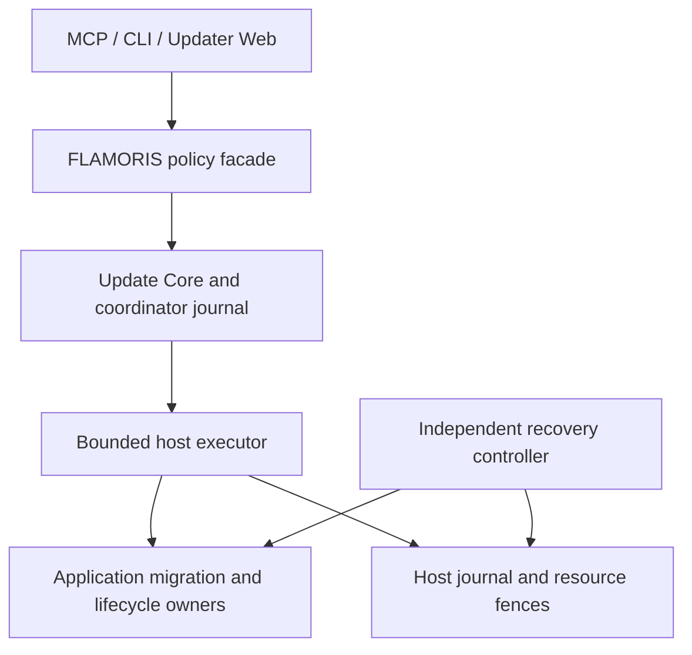

# Detailed design: draft 1

Date: 2026-10-08. **Design proposal only. No runtime or deployment is implemented.**

The accepted boundaries in [DESIGN.md](DESIGN.md) remain fixed. This draft chooses concrete v1 defaults so implementation can be scoped later. An implementation instruction is still required.

## Scope and selected defaults

| Decision | v1 design |
| --- | --- |
| Platform | Linux hosts with systemd; Docker and Native application adapters |
| Implementation | Python 3.12; importable transport-independent Core |
| Repository | One repository; Core, FLAMORIS wrapper, adapters and recovery support |
| Deployment | Native coordinator and native host executor; neither requires Docker to remain operable |
| Coordinator | One authoritative coordinator per management domain; no automatic leader election/failover |
| Persistence | SQLite on local persistent filesystems per coordinator/host; no shared network-filesystem journal |
| Release format | Strict JSON Manifest v1, exact-byte signed envelope, SHA-256 artifact identities |
| Signing | Ed25519 release signatures with locally pinned application-scoped trust keys |
| Interfaces | Internal authenticated JSON HTTPS; external Streamable HTTP MCP facade; local operator CLI; dedicated Updater Web UI |
| Updates | Durable asynchronous Jobs; one active mutating Job per host in v1 |
| Groups | Prepared on all hosts, then ordered activation behind admission gates; no distributed transaction |
| Recovery | Preserve known previous artifacts; unknown state requires verified reconciliation |
| Self-update | Independent native recovery controller and stable storage format |
| Bootstrap | Application-owned standalone migrations, then evidence-based enrollment |

No `pyproject.toml`, schema validator, CLI, host agent, CI workflow or deployment unit is added by this design. The [dedicated Updater Web UI](WEB_UI.md) belongs to this repository, independent of Studio, and is also unimplemented.

Python matches the existing service stack; [source inventory](ADOPTION.md) records the checked revisions. The .NET MCP Core/Logging libraries cannot be directly adopted as Python packages. Reuse their boundary principles and the Python MCP SDK patterns already present in the service family; do not create a .NET bridge just to import those packages.

Linux is the first platform. Core contracts remain portable, but Windows/macOS executors, Kubernetes, arbitrary custom shell adapters, automatic scheduling, general host diagnostics and unattended unknown-state repair are outside v1.

## Components and authority

| Component | Owns | Must not own |
| --- | --- | --- |
| `flamoris_update_core` | Models, validation, dependency/schema planning, Job state, authorization checks and journal ports | FLAMORIS IDs, hostnames, network listeners, subprocess implementation |
| `flamoris_updater` | Catalog, entry-version policy, dependency groups and domain composition | Application data transformation or GPU state machine |
| `flamoris_updater_adapters` | SQLite, release fetch/signature verification, HTTP/MCP, Docker/Native operations and dedicated Web adapter | Alternative execution authority |
| `flamoris_update_migration` | Shared application-embedded migration journal/protocol support | Application-specific handlers, dependency on coordinator service |
| Host executor | Local policy enforcement, resource fences, bounded lifecycle calls, local step results | Caller-selected command, path, image mount or privilege |
| Recovery controller | Minimal independent stop/inspect/restore/switch/verify operations | A second updater or an arbitrary shell service |

These are planned package names, not directories currently present. Each application can vendor its own handlers while consuming the common migration support from a pinned package built from this same repository. Exporting a package does not require another repository.

The coordinator is authoritative for plans and group progress. Host journals are authoritative for local effects. Application journals and actual schemas are authoritative for domain transformations. None can overwrite another authority's unknown state based on a timeout.

Server Manager supplies live operational investigation independently. Target-specific inspect/quiesce/validate operations needed for updating are application/executor contracts, not a new server diagnostic API.

## Identity model

| Identity | Meaning |
| --- | --- |
| `application_id` | Product release family; for example an Agent service |
| `deployment_id` | One configured deployment of an application |
| `host_id` | Operator-assigned stable host identity |
| `component_id` | Package embedded in a deployment artifact |
| `resource_id` | Persistent namespace or shared resource with registered writers |
| `manifest_digest` | Hash of exact signed Manifest bytes |
| `plan_id / plan_digest` | Immutable plan identity and content hash |
| `job_id / operation_id` | Durable execution and local effect identity |

Repository, application, deployment, component and schema versions are independent. A Controller package embedded in Generation is not an independent service to restart. Two hosts running the same application have different deployment IDs and usually different data resources.

Catalog/profile IDs resolve actual unit names, approved artifact repositories, data roots, DB backup domains, lifecycle endpoints and secret references locally. These private bindings are not fields a release publisher or MCP caller may supply.

## Coordination interfaces

Core depends on these ports, whose method names are design identifiers:

| Port | Operations |
| --- | --- |
| ReleaseStore | list/get immutable signed releases and notes |
| Inventory | inspect target deployment/component/resource identities |
| Planner | check compatibility, schema routes and update groups |
| Journal | durably record intents, results, request deduplication and recovery blockers |
| Authorizer | bind exact plan to actor, targets, policy and admission window |
| HostExecution | prepare, begin, run_step, inspect_operation, abort_preparation, release_after_validation |
| MigrationRunner | inspect, plan, apply_step, reconcile, validate |
| Lifecycle | close_admission, drain, stop, activate, health, reopen_admission |
| Backup | snapshot, restore_verify, restore, verify_restored_state |
| TrustPolicy | permitted publisher/application/channel and key epochs |

Network adapters use the same ports as local callers. The coordinator sends typed requests, not command strings. No retry decorator wraps mutating ports.

## Ownership and persistence

Coordinator records: releases, inventories, plans, authorizations, jobs, group steps, requests and evidence references.

Host records: prepared plans, operations, resource blockers, backup receipts, service/artifact bindings and application-validation results.

Application records: schema observations, migration runs/steps and reconciliation results. Existing SQL/Alembic history is preserved and mapped, not replaced with a new fabricated number.

SQLite constraints and transactions enforce one admission for a request key, unique local operation identity and resource ownership. Local advisory process locks protect journal access; persistent blockers survive process exit. Losing a process lock is not permission to clear a blocker.

A host does not initiate a new mutation when the coordinator is unreachable. It may complete an already admitted bounded step and persist the outcome. Continuing later steps requires reconciliation with the same authoritative Job. A recovered coordinator reads host records before making any further decision.

## Design completion boundary

The draft specifies [release data](RELEASE_MANIFEST.md), [migration](MIGRATION_CONTRACT.md), [execution/recovery](EXECUTION_RECOVERY.md) and [MCP](MCP_API.md). [Adoption](ADOPTION.md) separates inspected source from pending live deployment inventory and implementation tasks.

Actual trust-key provisioning, private host profiles, DB-role scopes, backup destinations and application-specific drain/health handlers require the owning deployment work. These are inputs to the design, not reasons to invent working defaults.

## Privilege boundary and native packaging

Coordinator and network-facing executor run as dedicated unprivileged service accounts. A minimal local privileged helper performs only typed operations against root-owned host profiles. Docker daemon access stays with that helper; adding the coordinator to a Docker-capable group is not least privilege.

Profiles constrain unit IDs, image registries/digests, volume bindings, runner identity, network destinations, quotas and writable roots. Publisher-signed migration code is still code with effects: run it with only its DB/config/data rights, never coordinator/root credentials. The helper refuses publisher-provided privilege additions, mounts or executable paths.

Admission checks staged Native bundle interpreter/platform dependencies without pip/compilation on the host. CI packaging may use an embedded interpreter or a verified compatible pre-provisioned interpreter declared by the bundle profile; missing runtime support blocks preparation instead of building locally.

When updating GPU Node Manager itself, freeze management transitions, verify its existing runtime/job obligations and preserve lifecycle evidence. A bounded service artifact switch is not permission to kill managed GPU runtimes or replace the manager's state machine. The application must provide a compatible maintenance/handoff contract.

## Host protocol shape

Proposed internal paths under `/api/v1`:

| Path/action | Purpose |
| --- | --- |
| `POST /deployments/inspect` | Bounded target-specific identity/schema inspection |
| `POST /plans/prepare` | Stage exact signed content, reserve host and return durable preparation receipt |
| `POST /jobs/begin` | Bind accepted Job/grant to prepared identities and persist local admission |
| `POST /operations/run` | One allowlisted typed operation with immutable operation ID |
| `GET /operations/{id}` | Return durable intent/result for response-loss reconciliation |
| `POST /preparations/abort` | Drop confirmed effect-free staging/reservations |
| `POST /resources/release` | Release blocker only against verified final Job/resource evidence |

All responses carry protocol version, authenticated domain/host identity, request/operation IDs and journal revision. Unknown methods/fields fail closed. Every effect request binds exact plan/Job/step/resource IDs plus a coordinator-authenticated grant/admission receipt; the executor checks local scope/profile/identity independently.

The coordinator is trusted to attest operator authorization within its restricted management domain; a compromised coordinator cannot ask the helper for undeclared paths/privileges. Host keys and operator-authority keys are distinct from release publisher keys. Provisioning these identities is part of private bootstrap.

Local helper operations use the same typed operation IDs and root-owned profile lookups on a peer-authenticated socket. An operation may invoke indexed, publisher-trusted migration code only in the approved isolated runner scope.

## 日本語の設計要点

- 汎用CoreとFLAMORISラッパーは同じリポジトリ。Python 3.12を提案し、MCPはCoreへの外部入口とする。
- 管理役と各ホストの実行機構はNativeで常駐。DockerアプリとNativeアプリを管理するが、任意シェルは受け付けない。
- 更新計画を固定し、認可後は永続Jobで実行する。不明な結果は再実行せず、記録と対象データの保護を維持する。
- Migrationは設定・DB・保存データの組合せを検証して経路を選ぶ。管理開始前の移行は各アプリが単独で行う。
- 複数ホストは全対象を準備してから受付停止・復元確認・順次切替を行う。失敗時は人間とAIが復旧を判断する。
- Updater自身の更新は独立した小さな復旧機構で扱い、履歴を古い状態へ巻き戻さない。

これは詳細設計案であり、実装・実機反映はまだ行わない。
