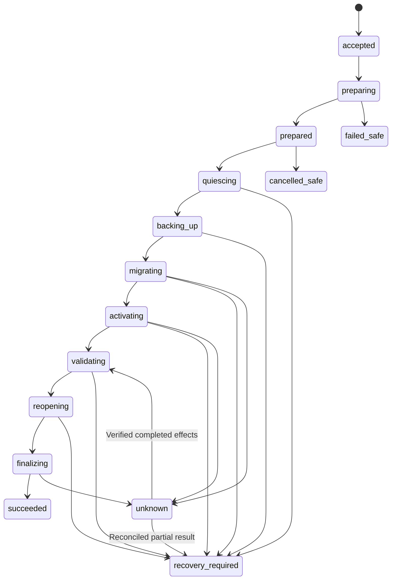

> Historical design/integration record. The current simple flow is in [running](RUNNING.md) and [installation](INSTALL.md). Backup/restore, unmanaged import and client PKI requirements/examples below are superseded and are not accepted current contracts. Publication/full-host acceptance do not gate controlled installation tests.

# Execution, persistence and recovery v1

> Reviewed execution design with v1 source implementation. [Running](RUNNING.md) and [implementation review](IMPLEMENTATION_REVIEW.md) describe executable behavior and coverage. Root helper/executor/controller replacement is an explicit v1 bootstrap blocker; protected automated self-update supports the coordinator with control format 1 only. Operational capacity monitoring and all real-host cases remain deployment gates.

**Reviewed v1 execution contract with source, services/scripts and SQLite schema implemented.** Real application owners and deployment acceptance remain separate gates.

## Immutable plan

A plan contains action (`update|install|recover|verify_recovery|self_update|executor_maintenance`), targets/host IDs, exact Manifest/artifact/component digests, input inventory/schema/config revisions, policy/trust epochs and minimum catalog sequence, resource/writer/group mapping, route/step IDs, dependency checks, ordered phases, admission/drain/validation/recovery profiles, backup/restore requirements, maximum step durations and latest admission time.

Persist one authoritative UTF-8 JSON byte string for each plan and compute `plan_digest` over those exact bytes. Reject duplicate keys, non-finite/fractional numbers and invalid Unicode. Hosts verify the sealed bytes/digest before decoding; they never reserialize a projection to derive authorization. Human display summaries and local JSON formatting are not authorization content. Plan identity, actions, targets, normalized operations and relevant preconditions are in the sealed payload.

Plan ID never changes. Any change to targets, route, privileges, profile or artifact requires a new plan. Preparation receipts and backups are later execution evidence attached to the Job, not edits to the plan. The plan preauthorizes their exact resource scope and verification contract.

Plans are created from cached/target-specific inspected state, then refreshed under execution fences before mutation. Server Manager evidence helps investigation but cannot substitute for locked application preconditions.

## Authorization

Operator grant binds actor, delegated caller if any, plan digest, target/resource scope, allowed phases, policy revision and an admission deadline. Default new-Job admission window: 15 minutes; maximum 60 minutes by protected policy. Denial, expiry or policy/revocation changes reject admission.

The external AI execution identity cannot create its own operator grant. Local operator CLI or the dedicated Updater Web operator flow issues it. A preconfigured human-owned policy can authorize a bounded plan class; MCP execution still resolves one concrete authorized plan. No per-step confirmation is required for already admitted ordinary phases.

A Job records the admitted grant and per-host operation receipts. Authorization expiry after valid admission does not strand an in-flight bounded step, but revocation prevents new phases. Stop at the next safe boundary; if data is already changed, retain gates and enter recovery. Finishing a destructive step is safer than interrupting it blindly.

Secrets are referenced by protected opaque IDs/version markers, never by secret value/hash in a plan. A reference/version/config change invalidates its relevant precondition.

## State machine

| Job state | Meaning / legal next actions |
| --- | --- |
| `accepted` | Durable request and grant admitted; prepare or cancel |
| `preparing` | Acquire logical host/resource fences, stage and verify artifacts on all hosts |
| `prepared` | All hosts have pinned content/policy receipts; enter maintenance or cancel |
| `quiescing` | Close admission and drain/fence writers; failure may require recovery |
| `backing_up` | Create consistent resource-group snapshot and verify restore |
| `migrating` | Execute declared application-owned steps sequentially |
| `activating` | Switch stopped deployment to staged artifact in dependency order |
| `validating` | Verify target schemas, lifecycle health and group invariants behind gates |
| `reopening` | Reopen gates under owner control and record any newly accepted work; resources still update-blocked |
| `finalizing` | Reconcile gate/lifecycle receipts, release local blockers and commit coordinator acceptance |
| `succeeded` | All required final receipts confirmed and coordinator inventory/blockers committed atomically |
| `failed_safe` | Failure with verified unchanged/restored state and known safe lifecycle |
| `cancelled_safe` | Cooperative cancellation with verified safe lifecycle and no unresolved effect |
| `recovery_required` | Known partial effects or failed target/restore validation; resources remain blocked |
| `unknown` | Lost/uncertain effect evidence; resources remain blocked pending reconciliation |

Terminal success is recorded only after every required final admission/lifecycle check. Transition to `failed_safe` needs evidence; a thrown exception is not that evidence. Recovery adds records to the old Job and may create a linked recovery Job. Completed/cancelled jobs cannot restart.

The diagram shows the principal path; any effect-bearing phase can become unknown. Skipped migration and backup phases require an explicit plan justification; updates with persistent resources always use required backup policy. Recovery verification is read-only and does not take the mutation path.

## Host admission and crash fencing

v1 admits one mutating Job per host, plus globally scoped resource/group locks in the coordinator. Acquire target host reservations in stable host-ID order. Rejected preparation releases only reservations confirmed to have no effects.

Local process locks are separate from persistent resource blockers. Hold owner-specific maintenance fences before touching shared data; cooperate with existing application/GPU owners instead of layering a conflicting lock order. Profile contracts declare lock ordering and cannot release GPU/job debt merely to enable an update.

A timeout/heartbeat loss marks a host uncertain; no automatic lease expiry permits a replacement coordinator/Job to mutate. This intentionally favors stopped updates over split execution. Human-controlled disaster takeover requires restoring journal continuity, rejecting old credentials, fencing the old coordinator and inspecting every local operation.

## Idempotency and reconnection

Request keys are scoped to authenticated principal/domain and action. Same key plus identical payload returns the existing plan/Job result; same key plus different payload returns `idempotency_conflict`.

Before the first host effect, persist Job admission, plan consumption and the request-key mapping in one coordinator transaction. Each plan can be consumed by at most one Job across every caller, grant, adapter and request key. Reuse of the consumed plan returns the existing Job only to an authorized reader; otherwise return `plan_consumed` without disclosing it. A second authorization/request key never permits a second execution of that plan, including after a terminal failure/cancellation. A retry/recovery needs a newly inspected plan.

Each host durably binds operation ID to Job/plan, action/step, normalized payload digest, resource set, maintenance epoch and predecessor receipts before effects. The same operation ID with any different binding returns `operation_conflict`; exact repeats return the persisted state. A retried transport request asks `inspect_operation`; unresolved intent is never run again. Querying an outcome cannot authorize the next step.

v1 retains mutation-key/operation tombstones without automatic deletion. If later retention is introduced it must preserve replay protection independently. Cursor pagination does not expose secret storage keys.

## Backup and restore verification

1. Establish the owner-issued durable maintenance epoch and gate every source of new work, including external/internal requests, timers and administrative writers.
2. Drain already accepted work, preserve unresolved effects, then fence/stop every writer in the declared backup/restore domain. Verify that candidates and restarted timers will honor the same epoch.
3. Record the protected pre-update schemas, mappings, ownership/ACLs and previous artifact identities.
4. Snapshot config, DB and persistent data consistently. Keep writer fences through activation/validation.
5. Restore the exact new snapshot into an isolated scratch target and run owner validators, schema/grant/content checks.
6. Persist the verified receipt bound to Job, resource set, snapshot digest and pre-update state.
7. Only then permit migration/activation.

Prior daily backups can contribute disaster recovery evidence but do not replace this Job's consistent pre-update snapshot by default. A restoration drill never restores into production.

Models are separately retrievable assets when identity/source/license/digest and retrieval access are verified; modified or unavailable originals are part of preservation. Generated media and user assets are persistent data, not disposable model downloads.

Backup content may contain credentials/user data: store with encryption and restricted roles/paths; MCP returns status and opaque receipt IDs only. Backup expiry/cleanup is a separate explicit policy, never automatic deletion at success.

No paid provider call or live GPU generation is a default health probe. Readiness validation must state whether it proves process, API, schema or domain behavior. Extra billable/destructive validation needs a separately declared authorized profile.

## Multi-host/group protocol

Prepare and verify immutable artifacts on all hosts first; then verify availability of all required admission/fencing/backup contracts. Preparation itself does not stop applications.

Close admission at all relevant external and internal entry points, drain/fence all affected writers, then take the coupled snapshot. Stop dependents before providers. Migration ordering follows resource dependencies; activate providers before dependents. Validate mixed internal versions only where the plan has proven interface compatibility.

Keep user/provider-writing traffic gated until the final group composition passes. Reopening gates is itself effect-bearing. If one gate reopens but a peer fails, close the reopened gate if its contract allows and reconcile any newly accepted work; never automatically restore DBs behind possible new writes. Atomic reopening across hosts is not claimed.

If intermediate composition cannot be proven safe even while gated, reject the plan. Missing drain/fence functionality or unknown jobs blocks the group. Degraded clients are not quietly allowed to call an incompatible provider.

A known failure does not roll back each application independently. Evaluate restoration as the same consistency group. Unknown result, unreachable host or incomplete writer fencing preserves resource blockers and enters investigation. Healthy unrelated applications remain outside the group.

## Artifact-only rollback and data restoration

An artifact-only rollback is allowed only when domain validators prove the previous executable reads the current schema vector and no unknown work remains. Binary reversal never implies schema reversal.

Data restoration requires the verified pre-update group snapshot, all writers fenced, restoration-role authorization and evidence that no post-snapshot external effects/new accepted writes would be lost or duplicated. The recovery plan names every affected resource and previous executable. Revalidate permissions/data and reopen gates last.

A default failure retains gates and evidence for human + AI. Optional automatic rollback is limited to an already authorized plan branch with unchanged data, confirmed operation outcomes and verified previous-artifact compatibility. v1 does not automatically reverse a completed migration.

Manual scripts are produced as reviewable support artifacts outside the MCP execution surface. After manual repair, the executor/application verifies actual postconditions and records evidence. An operator statement alone cannot clear a data/unknown-operation blocker.

## Independent recovery and self-update

Install a small recovery controller before protected Updater self-update. It uses a stable local control protocol, pinned trusted versions, host journal format v1 and narrowly scoped privileged operations. It remains executable when coordinator/MCP dependencies fail.

Self-update is a dedicated Job after all other mutations are idle. The stable controller holds coordinator ownership fencing, stages/verifies the new bundle, checkpoints journal/requests, stops the old coordinator, changes the active release pointer, starts the new version and checks read-only journal compatibility plus API readiness. The new coordinator starts maintenance-only until the controller commits handoff; it cannot admit application updates, issue grants/sessions or run startup migrations/background control-state writes during validation. The controller may record bounded handoff evidence in the stable journal.

Restore the previous pointer only when storage compatibility is verified. In v1, Updater self-releases must read/write journal v1 without destructive storage migration. Upgrading storage/recovery-controller protocol is a separate human-run bootstrap operation, not a routine self-update branch.

Recovery controller takeover must stop/fence both candidate coordinators. It never restore-copies an old journal over newer operations. Backups help only after fencing/reconciliation; otherwise a stale DB could erase replay protection.

## Journal readability and limits

Authoritative SQLite files remain outside runtime release trees. Provide versioned allowlisted JSONL exports and a read-only independent inspector in the recovery bundle. Export includes intents, outcomes, digests, blocked resources and evidence IDs, not raw process output or secret values.

Commit authoritative intent before effects, flush its recovery export before a destructive effect and stop if evidence persistence fails. An export may lag only safe read/staging work; it is not a substitute for the authoritative host/application journals. Partial JSONL tails are reported as incomplete.

Bound request bodies to 1 MiB, runner result to 256 KiB and diagnostic error summaries to 8 KiB; host profiles set per-operation timeout and expanded artifact quota. Disk-full/journal-corruption checks fail before new mutations. Do not log request headers, credentials, arbitrary environment variables or application content.

## Installation

Install explicitly proves target resources absent using authoritative bindings;
inaccessible or unknown resources are not empty. Initialization is separate from
normal schema migration. Existing data rejects installation. There is no import,
conversion or registration fallback for an unmanaged deployment.

## Proposed journal records

These are data-model requirements, not DDL or a created database.

| Record | Key / invariant | Essential fields |
| --- | --- | --- |
| `inventory` | Deployment ID | Host/app/component identities, observation revision/time, artifact/config/schema refs, managed installation state |
| `plans` | Plan ID; unique digest | Authoritative sealed JSON bytes, action, scope, preconditions, expiry |
| `authorizations` | Grant ID | Plan digest, actor/delegation, roles/resources, policy epoch, admitted/revoked times |
| `requests` | Unique principal/domain/action/key | Payload digest, admitted Job/plan ID and original outcome; permanent tombstone |
| `jobs` | Job ID; unique consumed plan ID | Plan/grant IDs, current phase/state, recovery linkage, timestamps |
| `operations` | Unique host/operation ID; immutable binding digest | Job/plan/action/step/profile, resources, maintenance epoch, predecessors, intent, result and uncertainty |
| `events` | Journal instance ID + monotonic sequence | Record type/ID, previous event digest, sanitized evidence refs |
| `resource_blocks` | Resource ID; one active owner | Job/operation, reason, fence receipt and verified release evidence |
| `backup_receipts` | Receipt ID | Job/resources, snapshot identity, pre-update vector, isolated verification/restore conditions |
| `reconciliations` | Evidence ID | Original operation, inspector/actor, verified state and blocker transition |

Host and coordinator journals share IDs but never duplicate authority. Compare expected revisions on state transitions; sequence/hash chains detect accidental export gaps, not compromise by a privileged writer. Backup/journal integrity and filesystem access controls remain separate controls.

v1 uses SQLite full synchronous durable transactions, local storage, bounded WAL/checkpoint handling and protected DB/WAL/SHM files. A recovery inspector understands incomplete commits and validates journal schema/version. Filesystem capacity includes backup plus worst-case WAL/export/artifact staging, with an explicit reserve checked before admission.

The finalizing decision and complete validation/gate receipts are durable before requesting local blocker release. Each local release is itself an immutable operation with a persisted result. Only after all releases are confirmed does one coordinator transaction update accepted inventory, clear global Job/resource reservations and mark succeeded. A lost release acknowledgement is queried; it does not recreate the blocker or repeat activation. Until that final transaction, the domain cannot admit another conflicting Job. Host/coordinator finalization is not one distributed transaction.

## Ordering, freshness and recovery verification

Dependency cycles are rejected unless an explicitly registered gated activation profile proves a supported start/health order for the complete group. A generic topological sort must not silently drop cyclic participants.

Authorization deadlines govern new Job admission. Host preparation/begin receipts bind the admitted Job and verified admission time; long preparation does not create an unbounded new grant. All hosts must have confirmed local admission before quiescing. A later missing/unknown host receipt requires reconciliation, not minting a new Job against the same data.

A fresh catalog confirming the exact authorized target is new evidence, not a plan edit. Changed relevant policy/profile/schema/config mappings or revoked trust abort the next phase. Normal data writes before maintenance are handled by drain/snapshot; verified resource ownership and schema invariants must still match.

Recovery verification returns validation evidence only. It does not itself restore data, reopen admission or remove blockers. The protected recovery controller checks all linked final evidence and lifecycle conditions before finalizing the old Job/resource blockers. Repaired schemas require a fresh plan; old authorizations never expand to unexpected new schemas.

## Maintenance continuity, restart and step ordering

An application-owned durable maintenance epoch is distinct from its process lock. It binds resource/group/Job ownership and remains effective when the old service/executor exits. Candidate startup, background timers and administrative paths must honor it before accepting writes or provider work. Hold business admission closed across restart.

A candidate validation profile must define maintenance startup: disable automatic schema initialization/migration and automatic job/provider replay. Permitted validation writes are explicitly scoped, journaled and accounted for in restoration conditions; they are not user business writes. Uncontrolled startup writes or missing epoch enforcement reject the plan.

Host execution enforces a declared step graph: confirmed local predecessor receipts, compatible fresh inspection, and required global barriers are prerequisites. A repeated request cannot skip backup or jump from prepare to activation. Coordinator-authenticated barrier receipts bind all group participant/predecessor results and their epochs to this Job. They do not expand host policy or replace local resource checks.

Updating a host executor uses a dedicated protected handoff: no ordinary group may replace its active execution authority while that authority owns an unresolved operation. Stop/fence the previous executor, preserve its journal/epochs and let the stable recovery controller verify the replacement before resuming. Unsupported executor maintenance/handoff is a plan blocker.

## Control-state compatibility

Unmanaged-deployment import is removed. The entry CLI, enrollment action and
transition/installation/adoption evidence field are no longer accepted. Old
records are not converted into a new managed installation or given a new identity.

Routine self-update compatibility covers all control state, not only the Job journal: application/operator identities, Web auth/session schemas, grants/revocations, plan consumption, request/operation tombstones, trust keys/catalog watermarks and maintenance epochs. Candidate verification uses the read-only compatibility view first. A self-release cannot destructively transform any of these v1 stores during routine handoff. Previous-version recovery preserves current control records; it never resurrects old grants/accounts/trust state from a snapshot.

Revoked or withdrawn target identities cannot be activated. A previous artifact can be used for rollback only under the current explicitly approved recovery trust policy; if neither target nor previous artifact is eligible, keep maintenance and stop for operator recovery instead of selecting another unsigned/older release.

## Action dispatch and recovery ownership

Plan action is enforced after protected deployment-role resolution, not inferred from a tool name or caller label.

| Action | Allowed effect path |
| --- | --- |
| update | Application preparation/maintenance/backup/migration/activation/finalization |
| install | Explicit absence proof and signed initialization, then validation/reopening/finalization |
| verify_recovery | Scoped inspection/validation and evidence publication only; no resource writes, restoration or blocker release |
| recover | Protected recovery-controller plan; supported restoration/repair and finalization for a linked parent |
| self_update | Protected coordinator handoff; never generic application execution |
| executor_maintenance | Protected host execution-authority handoff |

Local profiles classify coordinator/executor/recovery-controller roles. An alias or a multi-target group cannot route them through ordinary update/install execution. Recovery-controller/protocol/storage replacement remains a separate manual bootstrap operation.

A read-only verify_recovery child may inspect under its parent's persistent block, respecting the resource owner's stable-observation contract. It acquires no independent mutation right; an unsettled/running parent effect returns unknown. Its evidence does not finalize the parent.

A mutating recovery child requires explicit protected authorization plus a frozen parent, all effect-producing processes/operations reconciled or positively fenced, and a supported consistency-group recovery plan. The controller first persists the ownership-handoff intent, then performs revision-checked transfers of the original host/resource reservations to the linked child. No two Jobs gain concurrent rights. Partial handoff remains blocked and is reconciled; no automatic release or fresh ordinary-Job admission is allowed.

Parent operations keep immutable IDs/outcomes, and parent updates cannot resume after handoff. Recovery evidence links the resolution rather than changing a failed update into a claimed original success. Successful recovery commits accepted inventory/blocker resolution and the linked child's outcome together at coordinator finalization.

## Coordinator epoch and interface availability

The stable controller owns a monotonically increasing coordinator authority epoch. Hosts bind operation admission to their confirmed domain/epoch and reject old-epoch mutations. During self-update or disaster takeover, gate domain admission, settle existing host obligations, stop/fence the old coordinator, advance the epoch and confirm it on all managed hosts before committing a new active authority. A missing acknowledgement blocks handoff; investigate rather than starting a second coordinator.

A previous executable selected for rollback starts under a new verified epoch; epochs/catalog/grant watermarks never roll back. Interrupted partial epoch propagation is reconciled by the controller while business update admission stays closed.

Ordinary CLI, MCP and Web require the coordinator API for normal operations. The separate local recovery CLI/inspector in the stable controller bundle is the outage-independent path. Read-only inspection is available there; any mutation still requires its protected recovery authorization and owner fencing.

## Safe failure and cancellation finalization

failed_safe/cancelled_safe require verified safe resource/lifecycle state, all relevant local reservation-release receipts and a coordinator transaction clearing the corresponding global reservations while persisting the terminal outcome. Keep plan-consumption tombstones. An incomplete release/final commit remains blocked/unknown; do not label it safe to admit new work. Early preparation cancellation requires no business gate reopening if no gate was closed.

Reconciliation resumes only the original action's recorded step graph and confirmed successor. Verified completed migration/activation can proceed to validation; unknown reopening/finalization reconciles gate/release receipts instead of replaying activation or claiming automatic success.
