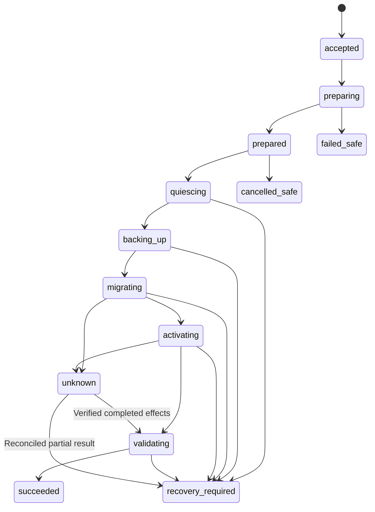

# Execution, persistence and recovery v1

**Draft 1; documentation only.** No services, scripts or DB schema are created.

## Immutable plan

A plan contains action (`update|install|enroll|recover|self_update`), targets/host IDs, exact Manifest/artifact/component digests, input inventory/schema/config revisions, policy/trust epochs and minimum catalog sequence, resource/writer/group mapping, route/step IDs, dependency checks, ordered phases, admission/drain/validation/recovery profiles, backup/restore requirements, maximum step durations and latest admission time.

Serialize plan values with a specified deterministic JSON encoding: sorted object keys, UTF-8, no insignificant whitespace, integer-only numbers and no duplicate keys. Hash these immutable bytes as `plan_digest`; display summaries are not part of authorization.

Plan ID never changes. Any change to targets, route, privileges, profile or artifact requires a new plan. Preparation receipts and backups are later execution evidence attached to the Job, not edits to the plan. The plan preauthorizes their exact resource scope and verification contract.

Plans are created from cached/target-specific inspected state, then refreshed under execution fences before mutation. Server Manager evidence helps investigation but cannot substitute for locked application preconditions.

## Authorization

Operator grant binds actor, delegated caller if any, plan digest, target/resource scope, allowed phases, policy revision and an admission deadline. Default new-Job admission window: 15 minutes; maximum 60 minutes by protected policy. Denial, expiry or policy/revocation changes reject admission.

The external AI execution identity cannot create its own operator grant. Local operator CLI or a future Studio operator flow issues it. A preconfigured human-owned policy can authorize a bounded plan class; MCP execution still resolves one concrete authorized plan. No per-step confirmation is required for already admitted ordinary phases.

A Job records the admitted grant and per-host operation receipts. Authorization expiry after valid admission does not strand an in-flight bounded step, but revocation prevents new phases. Stop at the next safe boundary; if data is already changed, retain gates and enter recovery. Finishing a destructive step is safer than interrupting it blindly.

Secrets are referenced by protected opaque IDs/version markers, never by secret value/hash in a plan. A reference/version/config change invalidates its relevant precondition.

## State machine

| Job state | Meaning / legal next actions |
| --- | --- |
| `accepted` | Durable request and grant admitted; prepare or cancel |
| `preparing` | Acquire logical host/resource fences, stage and verify artifacts on all hosts |
| `prepared` | All hosts have pinned content/policy receipts; enter maintenance or cancel |
| `quiescing` | Close admission and drain/fence writers; failure may require recovery |
| `backing_up` | Create consistent resource-group snapshot and verify restore |
| `migrating` | Execute declared application-owned steps sequentially |
| `activating` | Switch stopped deployment to staged artifact in dependency order |
| `validating` | Verify target schemas, lifecycle health and group invariants behind gates |
| `succeeded` | Reopen admission safely, record acceptance and release logical fences |
| `failed_safe` | Failure with verified unchanged/restored state and known safe lifecycle |
| `cancelled_safe` | Cooperative cancellation with verified safe lifecycle and no unresolved effect |
| `recovery_required` | Known partial effects or failed target/restore validation; resources remain blocked |
| `unknown` | Lost/uncertain effect evidence; resources remain blocked pending reconciliation |

Terminal success is recorded only after every required final admission/lifecycle check. Transition to `failed_safe` needs evidence; a thrown exception is not that evidence. Recovery adds records to the old Job and may create a linked recovery Job. Completed/cancelled jobs cannot restart.

The diagram shows the principal path; any effect-bearing phase can become unknown. Skipped migration and backup phases require an explicit plan justification; updates with persistent resources always use required backup policy. Enrollment is inspect/validate/record only and does not take the mutation path.

## Host admission and crash fencing

v1 admits one mutating Job per host, plus globally scoped resource/group locks in the coordinator. Acquire target host reservations in stable host-ID order. Rejected preparation releases only reservations confirmed to have no effects.

Local process locks are separate from persistent resource blockers. Hold owner-specific maintenance fences before touching shared data; cooperate with existing application/GPU owners instead of layering a conflicting lock order. Profile contracts declare lock ordering and cannot release GPU/job debt merely to enable an update.

A timeout/heartbeat loss marks a host uncertain; no automatic lease expiry permits a replacement coordinator/Job to mutate. This intentionally favors stopped updates over split execution. Human-controlled disaster takeover requires restoring journal continuity, rejecting old credentials, fencing the old coordinator and inspecting every local operation.

## Idempotency and reconnection

Request keys are scoped to authenticated principal/domain and action. Same key plus identical payload returns the existing plan/Job result; same key plus different payload returns `idempotency_conflict`.

Before the first host effect, persist Job admission and the request-key mapping in one coordinator transaction. Each host persists its operation ID/plan digest/intent before its effect. A retried transport request asks `inspect_operation`; it never repeats `run_step` while intent has an unresolved outcome.

v1 retains mutation-key/operation tombstones without automatic deletion. If later retention is introduced it must preserve replay protection independently. Cursor pagination does not expose secret storage keys.

## Backup and restore verification

1. Gate new application requests and drain known accepted work.
2. Fence/stop every writer in the declared backup/restore domain.
3. Record the protected pre-update schemas, mappings, ownership/ACLs and previous artifact identities.
4. Snapshot config, DB and persistent data consistently. Keep writer fences through activation/validation.
5. Restore the exact new snapshot into an isolated scratch target and run owner validators, schema/grant/content checks.
6. Persist the verified receipt bound to Job, resource set, snapshot digest and pre-update state.
7. Only then permit migration/activation.

Prior daily backups can contribute disaster recovery evidence but do not replace this Job's consistent pre-update snapshot by default. A restoration drill never restores into production.

Models are separately retrievable assets when identity/source/license/digest and retrieval access are verified; modified or unavailable originals are part of preservation. Generated media and user assets are persistent data, not disposable model downloads.

Backup content may contain credentials/user data: store with encryption and restricted roles/paths; MCP returns status and opaque receipt IDs only. Backup expiry/cleanup is a separate explicit policy, never automatic deletion at success.

No paid provider call or live GPU generation is a default health probe. Readiness validation must state whether it proves process, API, schema or domain behavior. Extra billable/destructive validation needs a separately declared authorized profile.

## Multi-host/group protocol

Prepare and verify immutable artifacts on all hosts first; then verify availability of all required admission/fencing/backup contracts. Preparation itself does not stop applications.

Close admission at all relevant external and internal entry points, drain/fence all affected writers, then take the coupled snapshot. Stop dependents before providers. Migration ordering follows resource dependencies; activate providers before dependents. Validate mixed internal versions only where the plan has proven interface compatibility.

Keep user/provider-writing traffic gated until the final group composition passes. Reopening gates is itself effect-bearing. If one gate reopens but a peer fails, close the reopened gate if its contract allows and reconcile any newly accepted work; never automatically restore DBs behind possible new writes. Atomic reopening across hosts is not claimed.

If intermediate composition cannot be proven safe even while gated, reject the plan. Missing drain/fence functionality or unknown jobs blocks the group. Degraded clients are not quietly allowed to call an incompatible provider.

A known failure does not roll back each application independently. Evaluate restoration as the same consistency group. Unknown result, unreachable host or incomplete writer fencing preserves resource blockers and enters investigation. Healthy unrelated applications remain outside the group.

## Artifact-only rollback and data restoration

An artifact-only rollback is allowed only when domain validators prove the previous executable reads the current schema vector and no unknown work remains. Binary reversal never implies schema reversal.

Data restoration requires the verified pre-update group snapshot, all writers fenced, restoration-role authorization and evidence that no post-snapshot external effects/new accepted writes would be lost or duplicated. The recovery plan names every affected resource and previous executable. Revalidate permissions/data and reopen gates last.

A default failure retains gates and evidence for human + AI. Optional automatic rollback is limited to an already authorized plan branch with unchanged data, confirmed operation outcomes and verified previous-artifact compatibility. v1 does not automatically reverse a completed migration.

Manual scripts are produced as reviewable support artifacts outside the MCP execution surface. After manual repair, the executor/application verifies actual postconditions and records evidence. An operator statement alone cannot clear a data/unknown-operation blocker.

## Independent recovery and self-update

Install a small recovery controller before enrolling Updater v1.0. It uses a stable local control protocol, pinned trusted versions, host journal format v1 and narrowly scoped privileged operations. It remains executable when coordinator/MCP dependencies fail.

Self-update is a dedicated Job after all other mutations are idle. The stable controller holds coordinator ownership fencing, stages/verifies the new bundle, checkpoints journal/requests, stops the old coordinator, changes the active release pointer, starts the new version and checks read-only journal compatibility plus API readiness. The new coordinator starts maintenance-only until the controller commits handoff; it cannot admit application updates during validation.

Restore the previous pointer only when storage compatibility is verified. In v1, Updater self-releases must read/write journal v1 without destructive storage migration. Upgrading storage/recovery-controller protocol is a separate human-run bootstrap operation, not a routine self-update branch.

Recovery controller takeover must stop/fence both candidate coordinators. It never restore-copies an old journal over newer operations. Backups help only after fencing/reconciliation; otherwise a stale DB could erase replay protection.

## Journal readability and limits

Authoritative SQLite files remain outside runtime release trees. Provide versioned allowlisted JSONL exports and a read-only independent inspector in the recovery bundle. Export includes intents, outcomes, digests, blocked resources and evidence IDs, not raw process output or secret values.

Commit authoritative intent before effects, flush its recovery export before a destructive effect and stop if evidence persistence fails. An export may lag only safe read/staging work; it is not a substitute for the authoritative host/application journals. Partial JSONL tails are reported as incomplete.

Bound request bodies to 1 MiB, runner result to 256 KiB and diagnostic error summaries to 8 KiB; host profiles set per-operation timeout and expanded artifact quota. Disk-full/journal-corruption checks fail before new mutations. Do not log request headers, credentials, arbitrary environment variables or application content.

## Installation and enrollment

Install explicitly proves every target resource absent using authoritative bindings; inaccessible/unknown/unmarked resources are not empty. Initialization runs behind the same fences, signed handlers and validation. Existing data rejects install and directs the operator to a standalone migration/enrollment path.

Enroll verifies entry release or later supported release, signed artifact/component identities, actual schemas, local profiles, writer/backup contracts and standalone transition evidence. It only commits inventory; it does not rewrite config, migrate DB, restart services or downgrade GPU Node Manager.

## Proposed journal records

These are data-model requirements, not DDL or a created database.

| Record | Key / invariant | Essential fields |
| --- | --- | --- |
| `inventory` | Deployment ID | Host/app/component identities, observation revision/time, artifact/config/schema refs, enrolled state |
| `plans` | Plan ID; unique digest | Immutable canonical bytes, action, scope, preconditions, expiry |
| `authorizations` | Grant ID | Plan digest, actor/delegation, roles/resources, policy epoch, admitted/revoked times |
| `requests` | Unique principal/domain/action/key | Payload digest, admitted Job/plan ID and original outcome; permanent tombstone |
| `jobs` | Job ID | Plan/grant IDs, current phase/state, recovery linkage, timestamps |
| `operations` | Unique host/operation ID | Job/step/profile IDs, intent, observed result and uncertainty |
| `events` | Journal instance ID + monotonic sequence | Record type/ID, previous event digest, sanitized evidence refs |
| `resource_blocks` | Resource ID; one active owner | Job/operation, reason, fence receipt and verified release evidence |
| `backup_receipts` | Receipt ID | Job/resources, snapshot identity, pre-update vector, isolated verification/restore conditions |
| `reconciliations` | Evidence ID | Original operation, inspector/actor, verified state and blocker transition |

Host and coordinator journals share IDs but never duplicate authority. Compare expected revisions on state transitions; sequence/hash chains detect accidental export gaps, not compromise by a privileged writer. Backup/journal integrity and filesystem access controls remain separate controls.

v1 uses SQLite full synchronous durable transactions, local storage, bounded WAL/checkpoint handling and protected DB/WAL/SHM files. A recovery inspector understands incomplete commits and validates journal schema/version. Filesystem capacity includes backup plus worst-case WAL/export/artifact staging, with an explicit reserve checked before admission.

The persistent logical blocker is released in a transaction only after its referenced final validation is committed. Failure to release after successful validation is reconciled; it never authorizes a duplicate update.

## Ordering, freshness and recovery verification

Dependency cycles are rejected unless an explicitly registered gated activation profile proves a supported start/health order for the complete group. A generic topological sort must not silently drop cyclic participants.

Authorization deadlines govern new Job admission. Host preparation/begin receipts bind the admitted Job and verified admission time; long preparation does not create an unbounded new grant. All hosts must have confirmed local admission before quiescing. A later missing/unknown host receipt requires reconciliation, not minting a new Job against the same data.

A fresh catalog confirming the exact authorized target is new evidence, not a plan edit. Changed relevant policy/profile/schema/config mappings or revoked trust abort the next phase. Normal data writes before maintenance are handled by drain/snapshot; verified resource ownership and schema invariants must still match.

Recovery verification returns validation evidence only. It does not itself restore data, reopen admission or remove blockers. The protected recovery controller checks all linked final evidence and lifecycle conditions before finalizing the old Job/resource blockers. Repaired schemas require a fresh plan; old authorizations never expand to unexpected new schemas.
